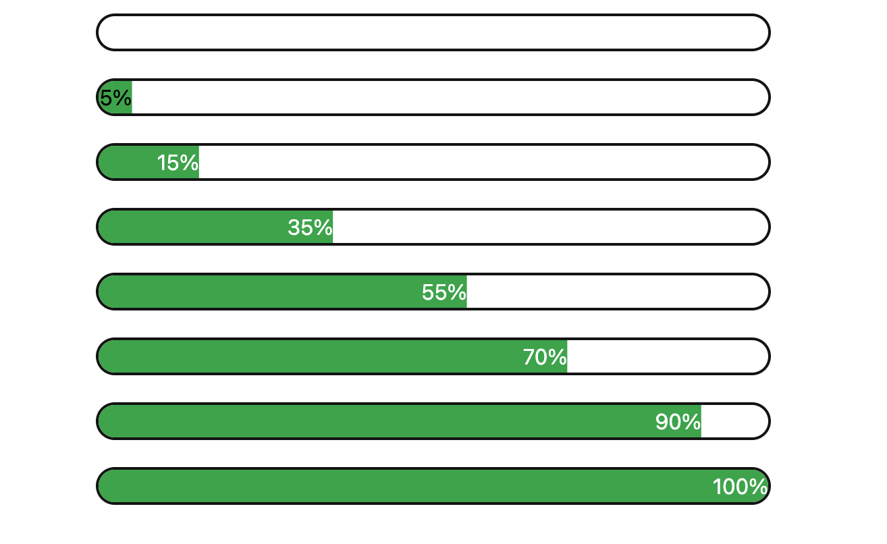

#  Animated Progress Bar (React + Tailwind CSS)

This project demonstrates a smooth, animated progress bar built using **React** and styled with **Tailwind CSS**. The progress bar visually transitions when the progress value changes, and includes accessibility features like `aria` roles.

##  Features

-  **Animated Progress**: Smooth transition using `ease-in-out`.
-  **Accessible**: Uses `role="progressbar"` and appropriate ARIA attributes.
-  **React Hooks**: Utilizes `useState` and `useEffect` for dynamic rendering.
-  **Tailwind CSS**: Fast styling with utility classes.

## 📷 Preview

 <!-- Add your screenshot path -->

##  Technologies Used

- React (Functional Components)
- Tailwind CSS
- JavaScript (ES6+)

---

##  How It Works

```jsx
import React, { useEffect, useState } from "react";

function ProgressBar({ progress }) {
  const [animatedProgress, setAnimatedProgress] = useState(0);

  useEffect(() => {
    setTimeout(() => {
      setAnimatedProgress(progress);
    }, 1000);
  }, [progress]);

  return (
    <div className="flex justify-center mt-[20px]">
      <div className="border-2 border-[#141313] w-[500px] rounded-2xl overflow-hidden">
        <div
          className="bg-green-600 text-white transition-all duration-1000 ease-in-out text-right"
          style={{
            transform: `translateX(${animatedProgress - 100}%)`,
            color: animatedProgress < 10 ? "black" : "white",
          }}
          role="progressbar"
          aria-valuemax={100}
          aria-valuemin={0}
          aria-valuenow={progress}
        >
          {progress}%
        </div>
      </div>
    </div>
  );
}

export default ProgressBar;